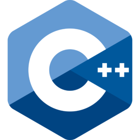

###  Hi there! I'm Joaquín&nbsp;

I'm  **Software Engineering student** from Granada, Spain, who is obsessed with the idea of improving himself and wants a platform to grow 🚀 and excel :1st_place_medal:.

- 👨🏽‍💻 I’m currently an student from University of Granada in my final year.
- 🌱 I’m currently learning Python, Web development and many more things.
- 📫 How to reach me: Send me an email to [joaquingv12@gmail.com](mailto:joaquingv12@gmail.com).
- 💬 Ask me about anything, I am happy to help.
  
**Languages and Tools:**  

<code></code>
<code></code>
<code></code>
<code></code>
<code></code>
<code></code>
<code></code>

